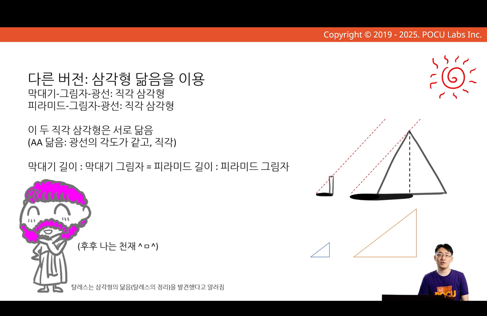
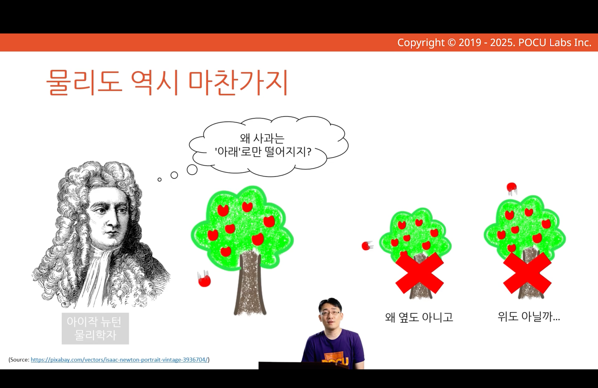
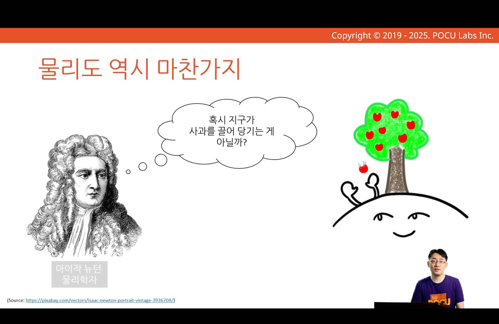
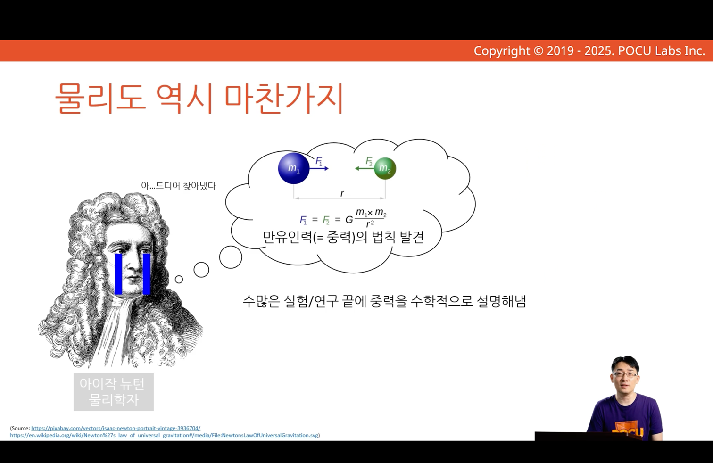

---
tags:
  - COMP1000
  - week0
aliases:
  - 수학이란 무엇일까요?
---
# 수학이란 무엇일까요?

## 수학이란?

- 수학의 본질에 대해 생각해보자
- 왜 프로그래머에게 수학이 필요한지 이해해보자

- 공식을 외우는 것은 수학이 아니다

- 수학은 세상을 이해하기 위한 학문

- 현상을 이해하고자 하는 노력의 예시로 탈레스의 일화

- 물리도 마찬가지

