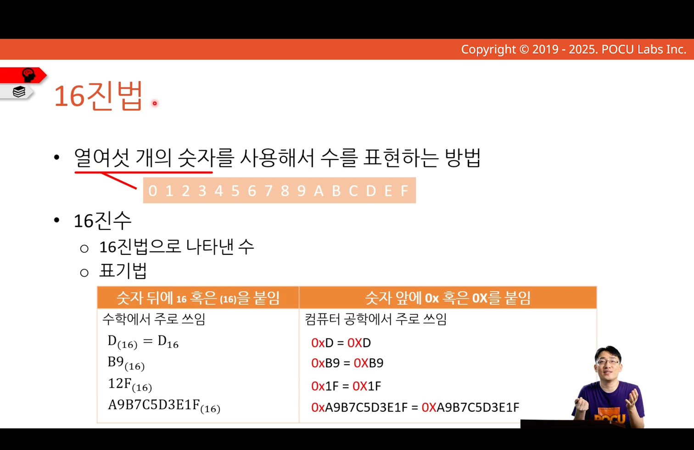
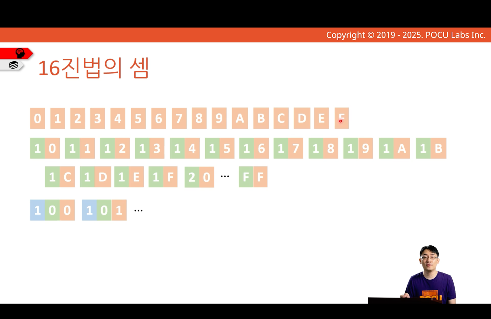
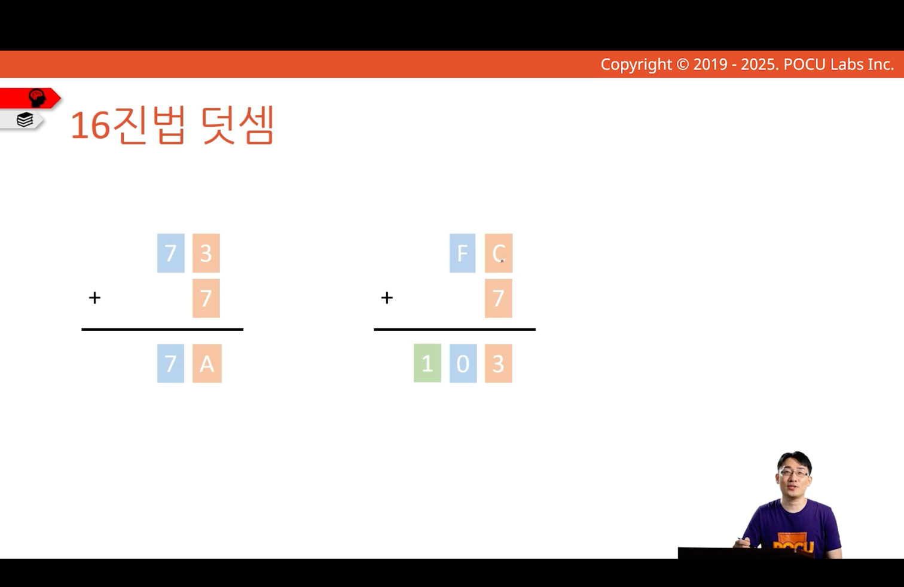
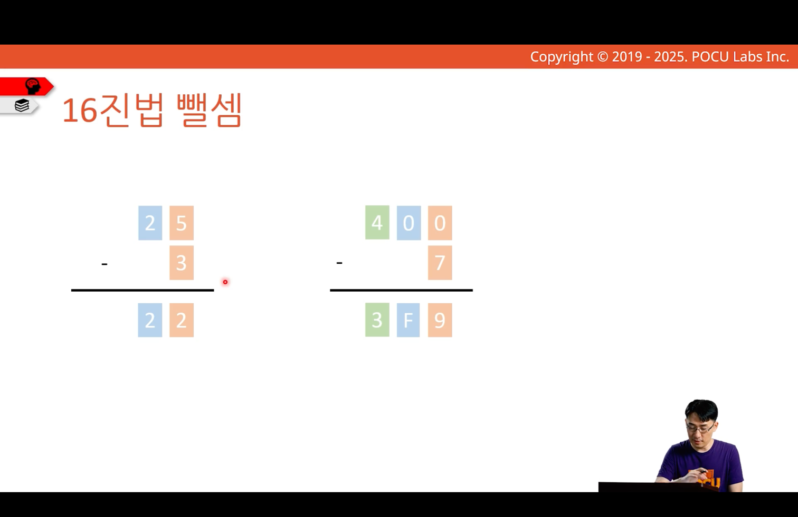

---
tags:
  - COMP1000
  - week1
---
# 16진법

## 16진법의 정의

한 자리에 쓸 수 있는 숫자가 16개
## 16진법의 셈

[[pocu_note/COMP1000/001-number-system-bits-and-bytes/001-002-decimal-system/index#carry-over|carry-over]] 적용
- 16^0의 자리는 최소값 0으로 돌아감
- 16^1의 자리는 1 증가

## 16진법 덧셈

carry-over 연쇄:
- 16^0의 자리는 다음과 같이 계산: C + 7 - 16 = 3
- 16^1의 자리는 1증가
- 16^1의 자리는 다음과 같이 계산: 1 + F - 16 = 0
- 16^2의 자리는 1증가

## 16진법 뺄셈

borrowing 연쇄:
- 16^0의 자리는 다음과 같이 계산: 16 - 7 = 9
	- 16^1의 자리에서 16 빌려옴
- 16^1의 자리는 다음과 같이 계산: 0 - 1 + 16 = F
	- 16^2의 자리에서 16 빌려옴
- 16^2의 자리는 다음과 같이 게산: 4 - 1 = 3
