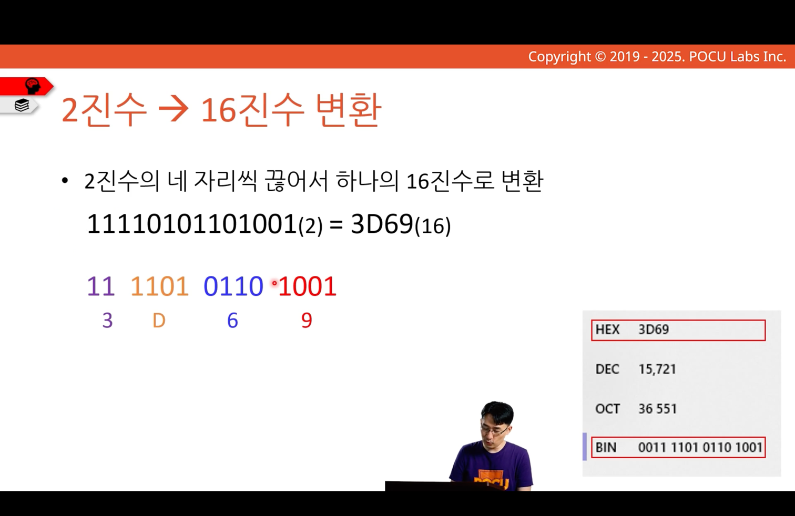
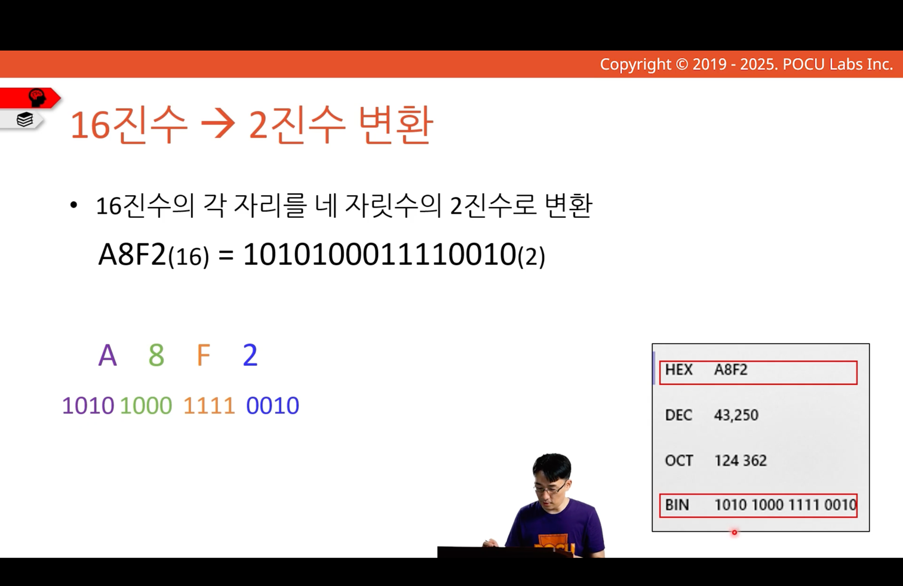

---
tags:
  - COMP1000
  - week1
---
# 2진수/16진수 변환

## 2진수를 16진수로 변환

[[pocu_note/COMP1000/001-number-system-bits-and-bytes/001-010-bin-to-oct/index|2진수를 8진수로 변환]] 참고
- 2^4 = 16
- 4자리씩 끊기

## 16진수를 2진수로 변환

[[pocu_note/COMP1000/001-number-system-bits-and-bytes/001-011-oct-to-bin/index|8진수를 2진수로 변환]] 참고
