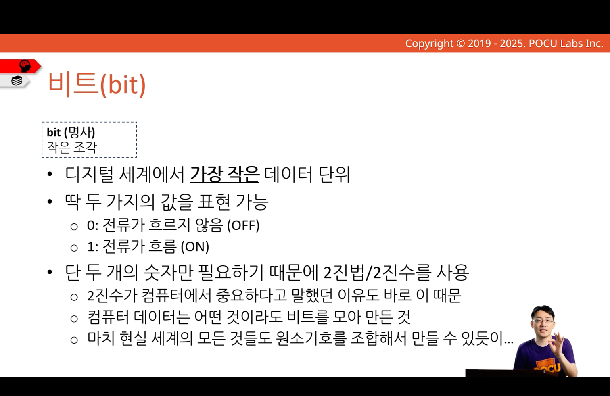
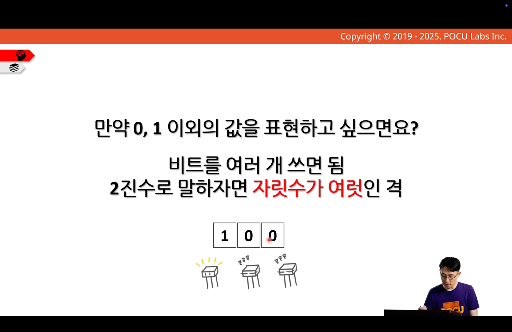
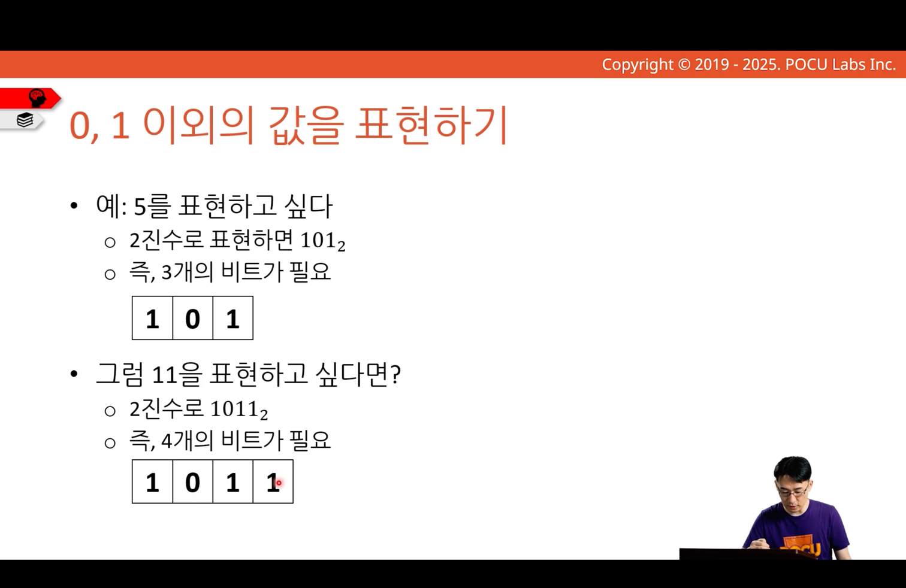
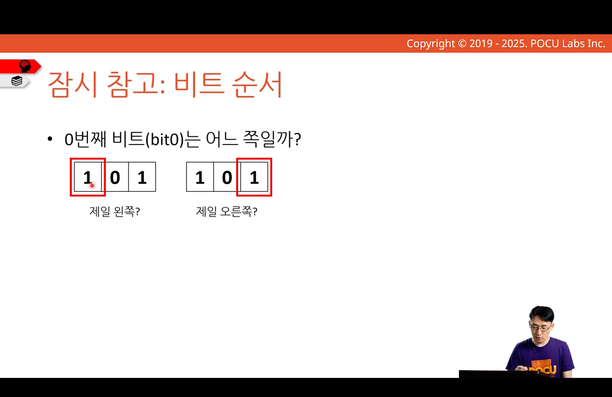
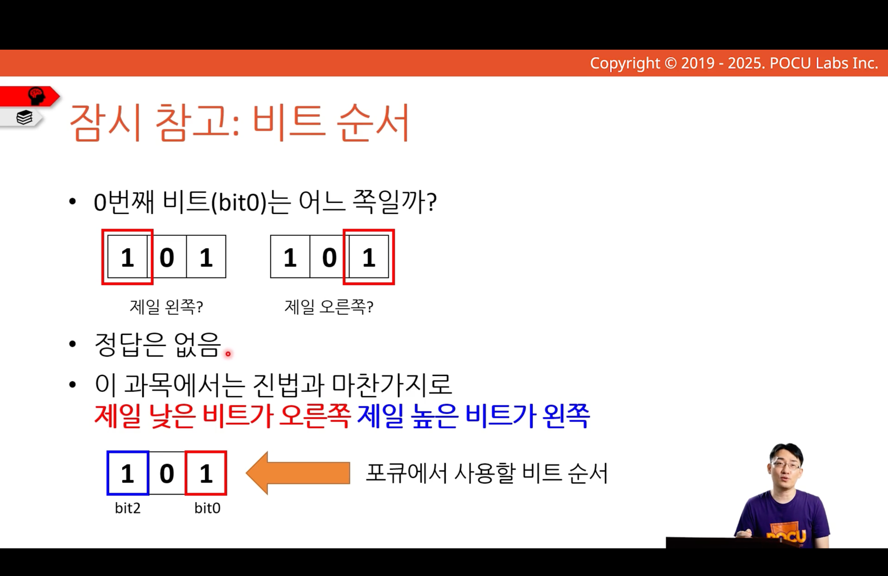

---
tags:
  - COMP1000
  - week1
title:
---
# 비트

컴퓨터에서 가장 작은 단위
- 2진법과 어울림

여러 비트를 사용해 큰 값을 표현할 수 있음

사실 상 [[pocu_note/COMP1000/001-number-system-bits-and-bytes/001-008-bin-to-dec/index|2진수를 10진수로 변환]]
## 비트의 순서

이 과목에서는 제일 낮은 비트가 오른쪽, 제일 높은 비트가 왼쪽
- 0번째 비트는 가장 오른쪽
- **가장 왼쪽**, **가장 오른쪽**과 같은 표현을 사용하는게 좋음
