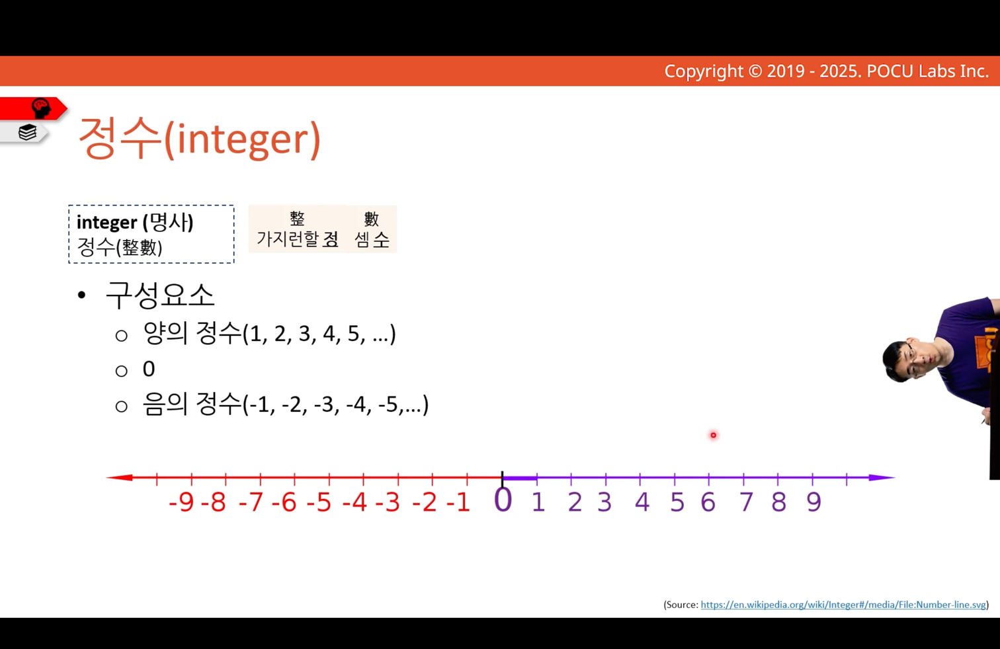
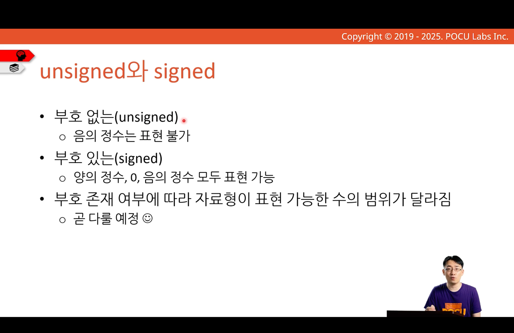
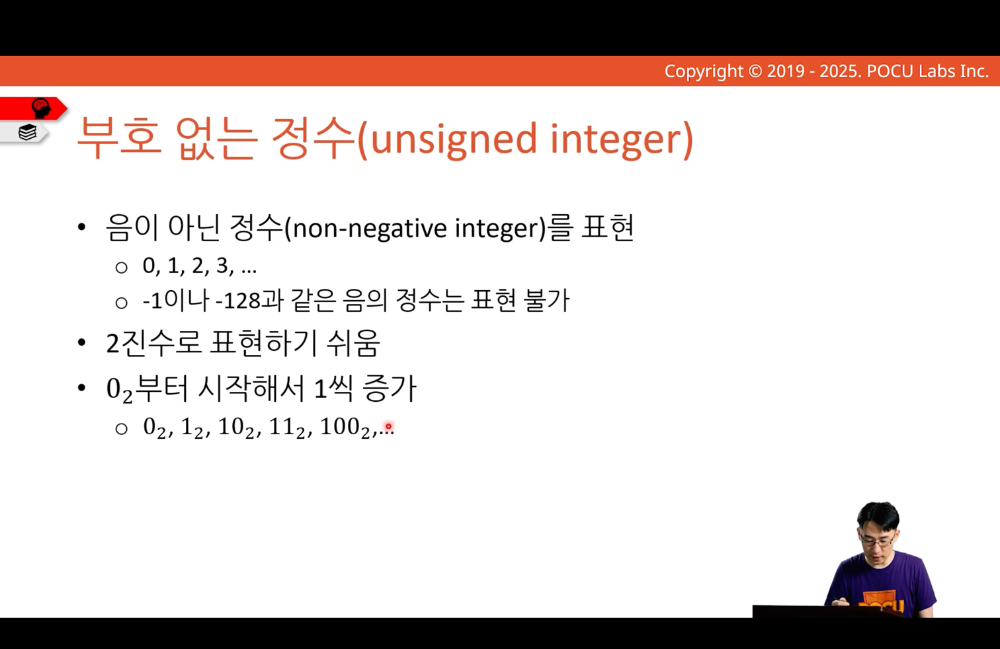
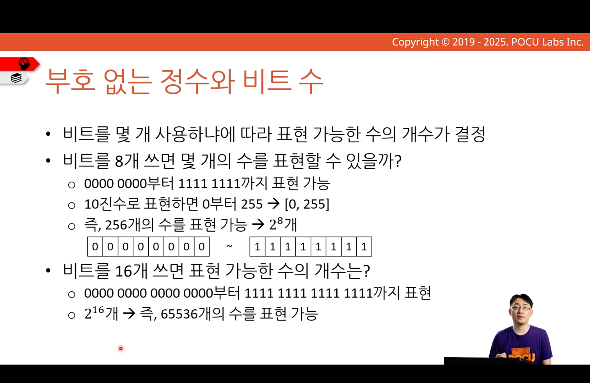

---
tags:
  - COMP1000
  - week2
aliases:
  - 정수, 부호없는 정수
---
# 정수, 부호없는 정수

컴퓨터의 데이터는 내부적으로는 비트로 저장
- 이 값을 어떻게 해석(읽는 방법)하냐에 따라 값이 다르게 보일 수 있음
- 동일한 비트 패턴이라도 다른 종류의 값으로 해석할 수 있음
	- 정수, 문자 등등
## 정수

양의 정수, 음의 정수를 표현할 때 부호의 개념이  추가

unsigned, signed는 표현 가능(허용 가능)한 수의 범위가 다름

## 부호 없는 정수

0부터 카운팅

비트를 n개 사용하면 2^n 개의 수를 표현할 수 있음
