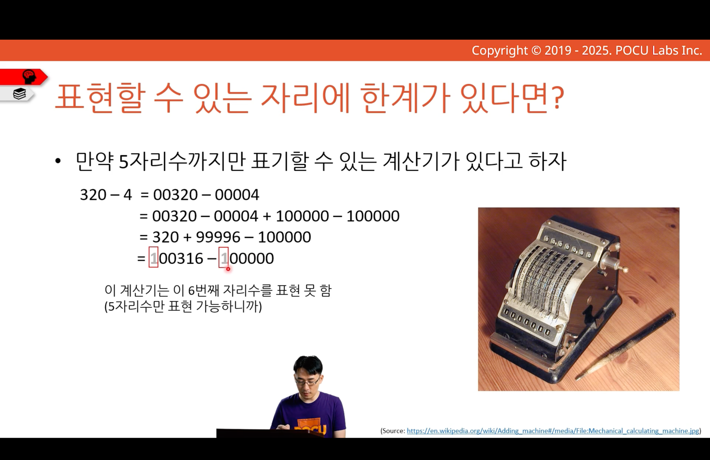
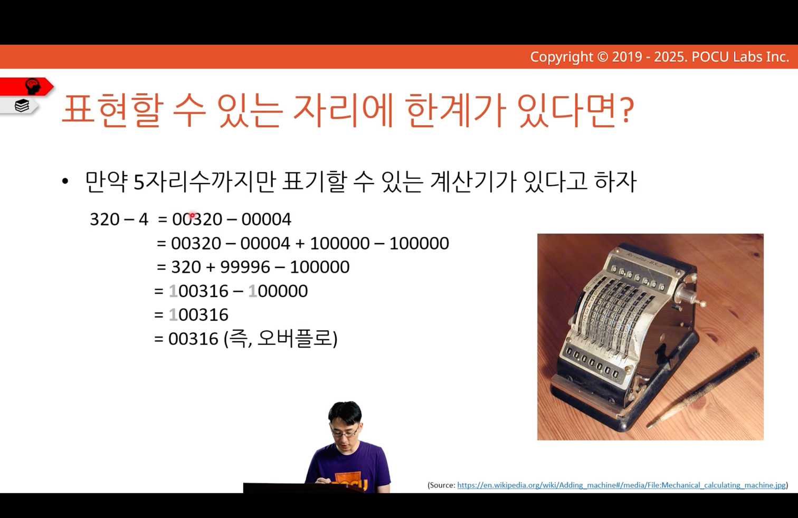
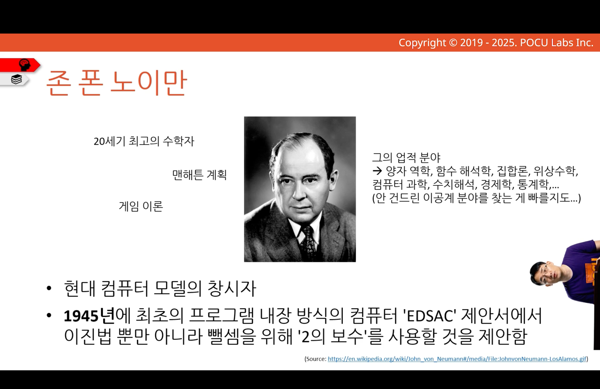
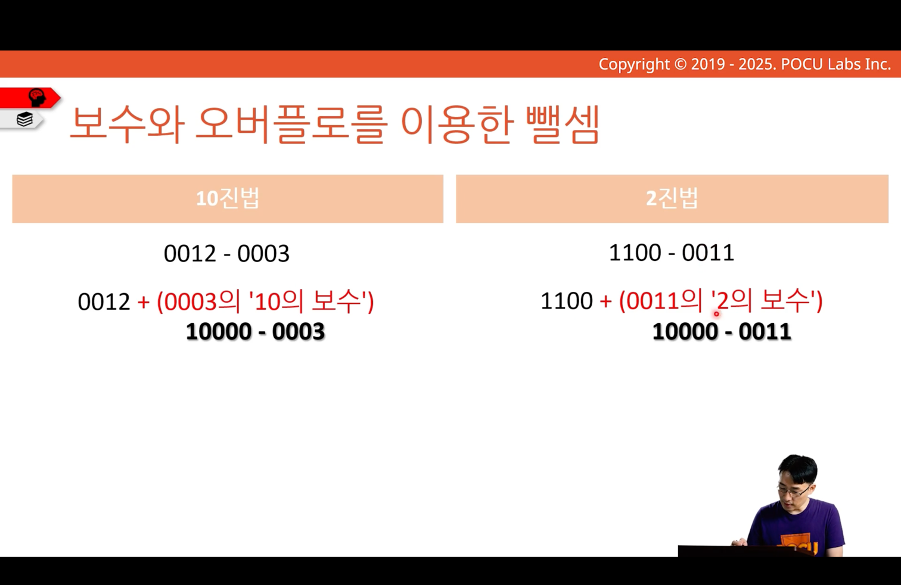
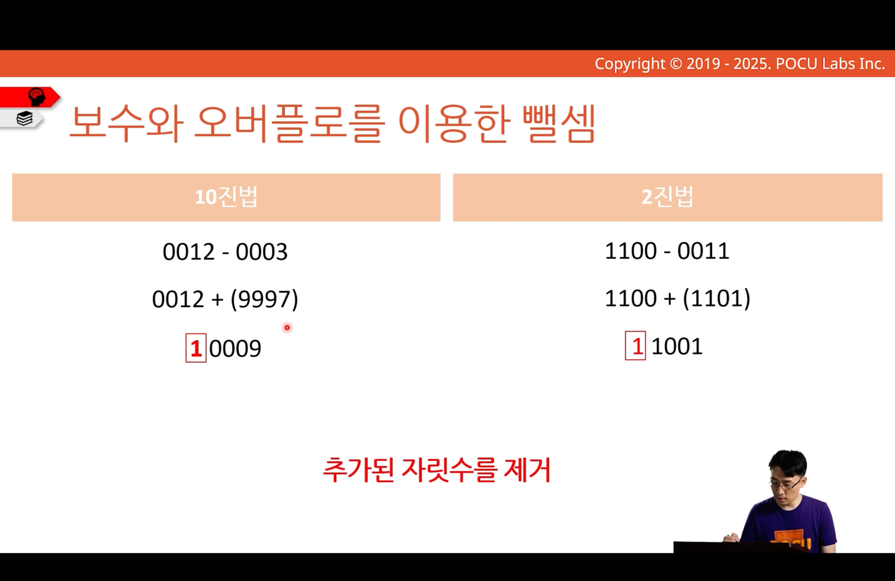
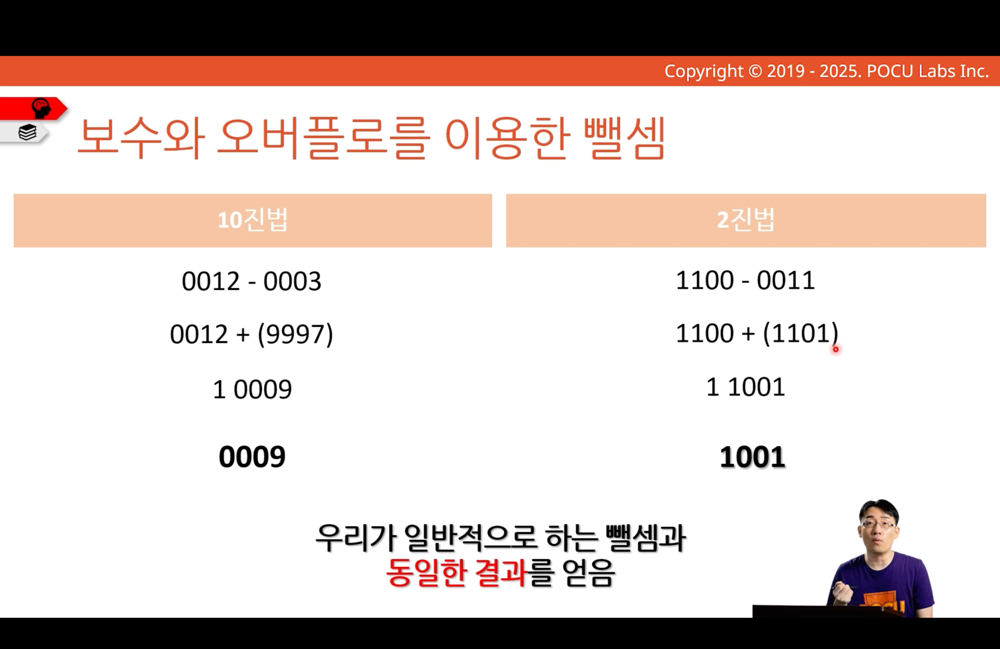
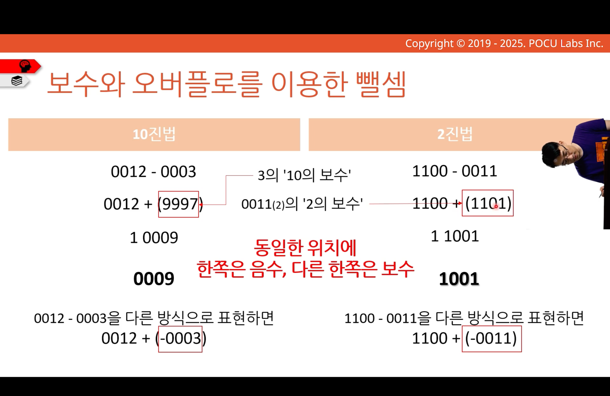

---
tags:
  - COMP1000
  - week2
aliases:
  - 보수를 이용한 음수 표현
---
# 보수를 이용한 음수 표현
## 파스칼 계산기

십진수 5자리
- radix complement 사용

`-00004 + 100000` 과정은 사람이 암산으로 수행해야 함
- 계산기가 6번째 자리수를 표현하지 못하기 때문

00320 + 99996 덧셈만으로 뺄셈가능
- 계산기가 오른쪽에서 6번째 자리를 표현할 수 없기에 자동으로 6번째 자리수 무시
	- 슬라이드에서 회색 표현

## 존 폰 노이만

## 보수와 오버플로를 이용한 뺄셈

아래 2단계를 수행
### 1. A + (B의 radix complement)

10진법 사례에서 `-10000`, 2진법 사례에서 `-10000`은 4자리 계산이라 무시
### 2. A + (B의 radix complement)에서 추가된 자릿수 제거

여기서는 `10000` 오른쪽에서 5번째 자리

뺄셈과 보수를 이용한 덧셈의 결과가 동일

A - B = A + (B의 radix complement) 에서 추가된 자릿수 제거

### 음수를 보수로 표현

A - B = A + (B의 radix complement) 에서 추가된 자릿수 제거
- 여기서 `-B`  =  `B의 radix complement`라는 결론을 도출 할 수 있음

음수를 보수로 표현가능
